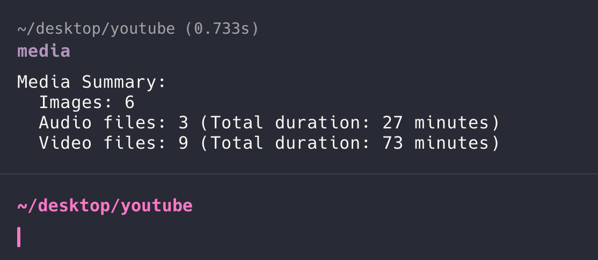

# Media Summary Function for Fish Shell

A **Fish shell function** to summarize media files in the current directory and its subdirectories. It provides:

- The count of **images**, **audio files**, and **video files**.
- The **total duration** of audio and video files.



---

## Features

- Automatically detects media files (images, audio, and video) based on file extensions.
- Uses `ffprobe` (from the FFmpeg suite) to calculate the duration of audio and video files.
- Outputs a neat summary directly in the terminal.

---

## Dependencies

This function requires the following tools to work:

1. **Fish Shell**  
   Install Fish shell on your system:
   ```bash
   brew install fish   # macOS
   sudo apt install fish  # Debian/Ubuntu
   ```

2. **FFmpeg (for ffprobe)**  
   Install FFmpeg to provide the `ffprobe` utility:
   ```bash
   brew install ffmpeg   # macOS
   sudo apt install ffmpeg  # Debian/Ubuntu
   ```

3. A modern Fish shell version. Ensure you're running Fish version **3.x** or later:
   ```bash
   fish --version
   ```

---

## Installation

### Step 1: Add the Function to Fish
1. Create the `functions` directory if it doesn't exist:
   ```bash
   mkdir -p ~/.config/fish/functions
   ```

2. Save the function as `media.fish` in the `functions` directory:
   ```bash
   nano ~/.config/fish/functions/media.fish
   ```

3. Paste the following code into the file:

   ```fish
   function media
       set image_extensions "jpg" "jpeg" "png" "gif" "bmp" "tiff"
       set audio_extensions "mp3" "wav" "flac" "aac" "ogg"
       set video_extensions "mp4" "mkv" "avi" "mov" "wmv"

       set image_count 0
       set audio_count 0
       set video_count 0
       set total_audio_duration 0
       set total_video_duration 0

       # Loop through files in the current directory and subdirectories
       for file in (find . -type f)
           set ext (echo (string split -r . $file)[-1] | tr '[:upper:]' '[:lower:]')

           # Check for image files
           if contains -- $ext $image_extensions
               set image_count (math $image_count + 1)
           end

           # Check for audio files
           if contains -- $ext $audio_extensions
               set audio_count (math $audio_count + 1)
               set duration (ffprobe -i $file -show_entries format=duration -v quiet -of csv="p=0" 2>/dev/null)

               # Validate and add to total_audio_duration
               if test -n "$duration" -a "$duration" != "N/A"
                   set total_audio_duration (math $total_audio_duration + $duration)
               end
           end

           # Check for video files
           if contains -- $ext $video_extensions
               set video_count (math $video_count + 1)
               set duration (ffprobe -i $file -show_entries format=duration -v quiet -of csv="p=0" 2>/dev/null)

               # Validate and add to total_video_duration
               if test -n "$duration" -a "$duration" != "N/A"
                   set total_video_duration (math $total_video_duration + $duration)
               end
           end
       end

       # Display the results
       echo "Media Summary:"
       echo "  Images: $image_count"
       echo "  Audio files: $audio_count (Total duration: "(math $total_audio_duration / 60)" minutes)"
       echo "  Video files: $video_count (Total duration: "(math $total_video_duration / 60)" minutes)"
   end
   ```

4. Save and close (`CTRL + O`, then `Enter`, and `CTRL + X`).

---

### Step 2: Reload Fish
Reload your Fish shell to apply the changes:
```bash
exec fish
```

---

## Usage

1. Navigate to a directory containing media files:
   ```bash
   cd /path/to/media/files
   ```

2. Run the `media` function:
   ```bash
   media
   ```

3. The output will display a summary like this:
   ```
   Media Summary:
     Images: 15
     Audio files: 20 (Total duration: 42.5 minutes)
     Video files: 10 (Total duration: 120.3 minutes)
   ```

---

## Customization

1. **Add more file extensions**:
   To support additional file types, edit the `image_extensions`, `audio_extensions`, or `video_extensions` variables in the function.

2. **Exclude hidden files**:
   Update the `find` command to ignore hidden files:
   ```fish
   find . -type f -not -path '*/.*'
   ```

3. **Add additional validations**:
   Enhance the logic to handle edge cases, such as corrupted files or invalid durations.

---

## Example

Let’s assume the current directory contains the following files:
```
image1.jpg
image2.png
audio1.mp3
audio2.wav
video1.mp4
video2.mkv
```

Running the function:
```bash
media
```

Output:
```
Media Summary:
  Images: 2
  Audio files: 2 (Total duration: 8.5 minutes)
  Video files: 2 (Total duration: 15.3 minutes)
```

---

## Contributing

Feel free to open issues or submit pull requests to improve this function. Contributions are welcome, whether it's adding support for more file types, optimizing performance, or improving error handling.

---

## License

This function is open-sourced under the **MIT License**. See the `LICENSE` file for more details.

---

## About

Hi there!, This **Hüseyin Demirtaş** speaking. I run [Hüseyin Demirtaş ile İngilizce](https://huseyindemirtas.net/), where I share resources and tools for English learners. I am a passionate language educator and technologist. This was initially for my own use but I though others could benefit from it too. 

GitHub: [dilsayar](https://github.com/dilsayar)

